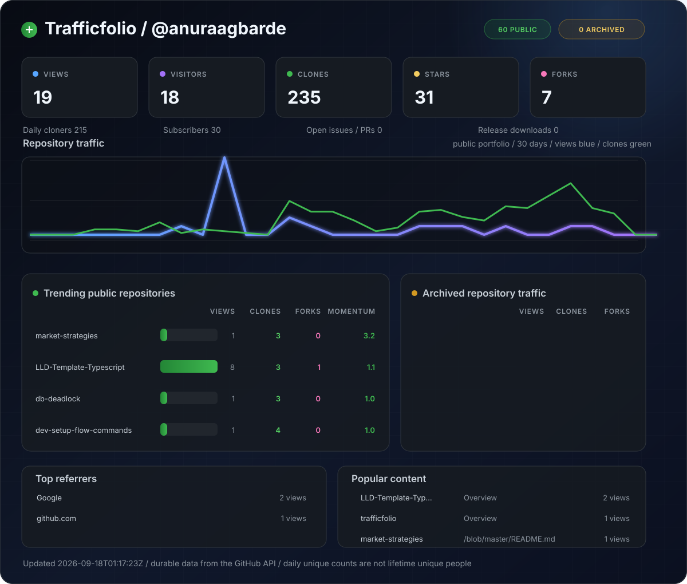

<div align="center">

# Trafficfolio

### Your GitHub traffic portfolio, living in a README.

Track views, visitors, clones, stars, forks, referrers, release downloads, and trending repositories with one daily GitHub Action. No server. No database. No subscription.

[](#how-it-works)
[](#why-trafficfolio)
[](./scripts/trafficfolio.py)
[](./LICENSE)

**Fork it. Add one secret. Own your analytics forever.**

</div>

<!-- TRAFFICFOLIO:START -->
> Dashboard waiting for its first run. Complete the setup below to activate it.

<p align="center"></p>
<!-- TRAFFICFOLIO:END -->

## Why Trafficfolio?

GitHub shows repository traffic for only the last 14 days. Trafficfolio takes a daily snapshot before it disappears, builds permanent history in your own repository, and turns this README into an account-wide analytics dashboard.

- **Lives entirely on GitHub** - GitHub Actions collects; Git stores; README presents.
- **Account-wide** - one job tracks every public repository owned by the fork owner.
- **Private by design** - your token stays in GitHub Actions secrets.
- **Fork-native** - no username, deployment, database, or hosting configuration.
- **Actually useful** - identify rising projects, acquisition sources, popular content, and clone activity.
- **Free for public repositories** - standard GitHub-hosted Actions runners cost nothing.

## Activate your dashboard in about 3 minutes

### 1. Fork this repository

Use the **Fork** button at the top of the page. Keep the fork public for free unlimited standard-runner usage and to share your dashboard.

### 2. Create a fine-grained personal access token

Open **GitHub Settings > Developer settings > Personal access tokens > Fine-grained tokens**, then create a token with:

| Setting | Value |
|---|---|
| Resource owner | Your personal GitHub account |
| Repository access | **All repositories** |
| Repository permissions: Administration | **Read-only** |
| Repository permissions: Contents | **No access required** for public repositories |
| Expiration | Your preferred rotation period |

Traffic data requires repository-owner access. Selecting all repositories also lets Trafficfolio discover new projects automatically. The token does not need source-code access to track public repositories. Organizations may require an administrator to approve the token.

### 3. Add the token to your fork

In your fork, open:

**Settings > Secrets and variables > Actions > New repository secret**

- Name: `TRAFFIC_TOKEN`
- Secret: paste the fine-grained token

Never put the token in a file, workflow, issue, pull request, or commit.

### 4. Enable Actions and write access

Forked public repositories start with scheduled workflows disabled:

1. Open the **Actions** tab and select **I understand my workflows, go ahead and enable them**.
2. Open **Settings > Actions > General**.
3. Under **Workflow permissions**, choose **Read and write permissions**, then save.

The workflow declares only `contents: write`. It uses the built-in `GITHUB_TOKEN` to commit generated files; `TRAFFIC_TOKEN` is read by the collector only.

### 5. Run it

Open **Actions > Update Trafficfolio > Run workflow**.

The first run normally finishes in a few minutes. Refresh this README after the green check appears. It will then update every day at approximately **23:17 UTC**.

> [!IMPORTANT]
> GitHub automatically disables scheduled workflows in a public repository after 60 days without repository activity. Trafficfolio's daily commits normally keep it active. If updates stop, open the Actions tab and re-enable the workflow.

## What the dashboard tracks

| Category | Metrics |
|---|---|
| Traffic | Views, daily unique visitors, clones, daily unique cloners |
| Growth | Stars, forks, subscribers, open issues/pull requests, release downloads |
| Discovery | Top referring sites and popular repository paths |
| Ranking | Trending repositories based on recent growth and engagement |
| History | Durable daily traffic and counter snapshots beyond GitHub's 14-day window |

GitHub does not expose profile-page visits through an official API. Trafficfolio intentionally reports official repository analytics rather than an unreliable image-request counter.

## How it works

```text
Daily GitHub Actions workflow
            |
            v
Discover repositories owned by the fork owner
            |
            v
Fetch traffic + repository + release metrics
            |
            v
Merge the rolling API window into data/dashboard.json
            |
            v
Render assets/dashboard.svg + README dashboard tables
            |
            v
Commit the update to the fork
```

Everything runs in a single Linux job to avoid per-repository runner startup and minute rounding. The collector uses only the Python standard library.

## Data and privacy

- `TRAFFIC_TOKEN` is read from GitHub's encrypted Actions secret store and is never written to disk or dashboard output.
- The workflow sends requests only to `api.github.com`.
- Trafficfolio stores aggregate counts, referrers, and popular paths. GitHub does not reveal visitor identities.
- Private repositories are excluded by default so a public dashboard cannot accidentally disclose their names or activity.
- The committed history is [`data/dashboard.json`](./data/dashboard.json). You can export, audit, or delete it at any time.

See the [security policy](./SECURITY.md) before reporting a vulnerability.

## Customize it

- Change the schedule in [`.github/workflows/update-dashboard.yml`](./.github/workflows/update-dashboard.yml).
- Adjust the dashboard window with `DEFAULT_DAYS` in [`scripts/trafficfolio.py`](./scripts/trafficfolio.py).
- Edit colors and layout in `render_svg()` in [`scripts/trafficfolio.py`](./scripts/trafficfolio.py).
- Keep exactly one `TRAFFICFOLIO:START` and `TRAFFICFOLIO:END` marker in this README. Generated content between them is replaced on every run.

### Optional: include private repositories

Only enable this when the Trafficfolio fork itself is private:

1. Give `TRAFFIC_TOKEN` read-only **Contents** permission in addition to read-only **Administration**.
2. Open **Settings > Secrets and variables > Actions > Variables**.
3. Create a repository variable named `INCLUDE_PRIVATE` with the value `true`.

Private repositories are otherwise skipped even when the token can access them.

Render existing data without calling GitHub:

```bash
DASHBOARD_OWNER=YOUR_USERNAME python scripts/trafficfolio.py render
```

Run the test suite:

```bash
python -m unittest discover -s tests -v
```

## Troubleshooting

<details>
<summary><strong>The workflow says TRAFFIC_TOKEN is missing</strong></summary>

Create a repository Actions secret named exactly `TRAFFIC_TOKEN`. Environment variables and Dependabot secrets are different stores.

</details>

<details>
<summary><strong>The API returns 403</strong></summary>

Confirm the token belongs to the fork owner, has access to all owned repositories, and grants read-only **Administration** permission. Private repositories additionally require read-only **Contents** permission and the `INCLUDE_PRIVATE` variable. If an organization owns a repository, it is not considered personally owned and is intentionally excluded.

</details>

<details>
<summary><strong>The push is rejected</strong></summary>

Enable **Read and write permissions** under **Settings > Actions > General > Workflow permissions**. Also check whether branch protection requires a pull request for generated commits.

</details>

<details>
<summary><strong>My historical visitor totals seem unusual</strong></summary>

GitHub reports unique visitors per day, not stable visitor identities. Trafficfolio sums daily unique values, so the same person visiting on two different days may be counted twice. Referrers and popular paths are saved as rolling snapshots and are not incorrectly added together.

</details>

## Project metadata

When publishing the upstream repository, use:

**Description**

> A fork-to-own GitHub traffic analytics dashboard that lives in your README. Track views, clones, stars, forks, referrers, and trending repos with GitHub Actions - no server required.

**Topics**

`github-actions` `github-analytics` `github-api` `repository-traffic` `readme-dashboard` `analytics-dashboard` `developer-tools` `traffic-analytics` `open-source` `self-hosted` `zero-cost` `python`

Recommended repository name: **`trafficfolio`**. At the time this project was named, GitHub repository search returned no exact-name match.

## Contributing

Ideas, bug reports, themes, and pull requests are welcome. Read [`CONTRIBUTING.md`](./CONTRIBUTING.md) to get started.

If Trafficfolio helps you understand your projects, star the upstream repository and share your dashboard. Every fork makes the project more useful.

## License

[MIT](./LICENSE) - use it, fork it, and make it yours.
